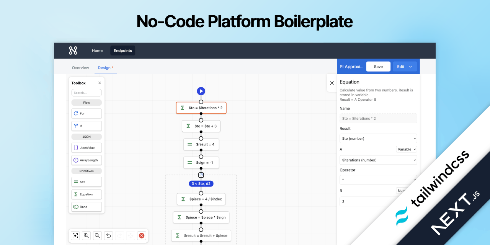
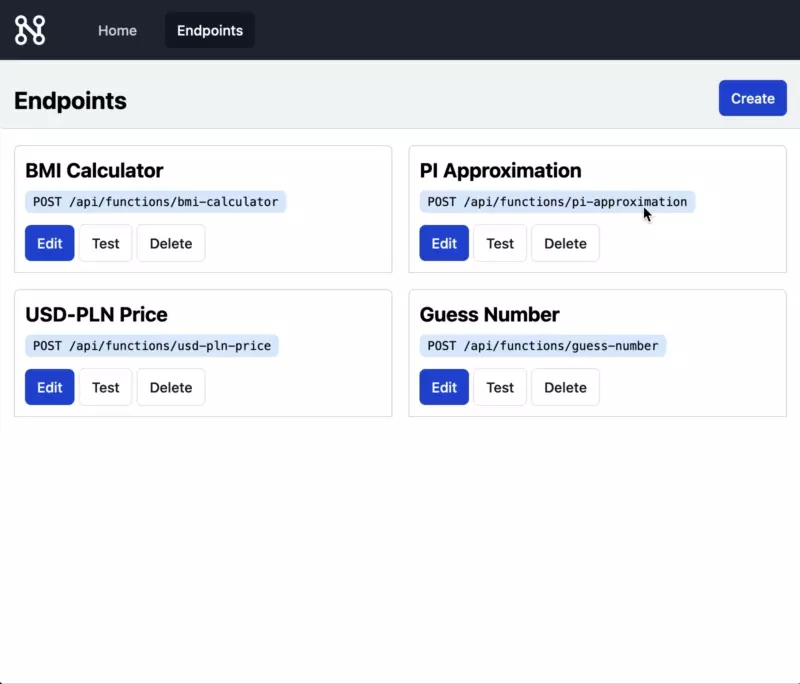

# No-Code Platform Boilerplate

Powerful Next.js boilerplate. Clone this repo and start your no-code platform today. The platform allows you to create REST API endpoints using a no-code editor. You can request the endpoint from any HTTP client. Additionally, the boilerplate provides a simple UI to test your endpoints. You can easily extend this template and add your own features.

<p align="center">
  
</p>

This boilerplate uses:

* [Next.js](https://github.com/vercel/next.js/)
* [Tailwindcss](https://github.com/tailwindlabs/tailwindcss)
* [🌇 Sequential Workflow Designer](https://github.com/nocode-js/sequential-workflow-designer)
* [🚚 Sequential Workflow Machine](https://github.com/nocode-js/sequential-workflow-machine)
* [⛽ Sequential Workflow Editor](https://github.com/nocode-js/sequential-workflow-editor)

The boilerplate supports two types of storage:

* `memory` - in-memory storage, used by default, for development purposes.
* `mongodb` - MongoDB storage, requires `MONGODB_URI` environment variable.

To choose storage type, set `STORAGE_TYPE` environment variable. You may do it by setting `.env` file:

```
STORAGE_TYPE=memory
```

or

```
STORAGE_TYPE=mongodb
MONGODB_URI=mongodb://localhost:27017
MONGODB_DB=nocodeApiBuilder
```

### Pro

🤩 Pssst... do you prefer React and Nest.js? Check the [No-Code Platform Boilerplate Pro](https://nocode-js.com/nocode-platform-boilerplate-pro/pricing).

## 🚀 Deployment

To deploy this boilerplate, you need any compatible with Next.js hosting.

[](https://vercel.com/new/clone?repository-url=https%3A%2F%2Fgithub.com%2Fnocode-js%2Fnocode-platform-boilerplate&project-name=nocode-platform&repository-name=nocode-platform&env=STORAGE_TYPE,MONGODB_URI)

To deploy this template to Vercel you need to set `STORAGE_TYPE=mongodb` and `MONGODB_URI` environment variables. The memory storage doesn't work with cloud hosting. We recommend to use [MongoDB Atlas](https://www.mongodb.com/cloud/atlas) for database hosting.

## 🔨 Development

You can work with NPM but we recommend to use [pnpm](https://pnpm.io/):

```bash
npm install -g pnpm
```

Clone this repository:

```bash
git clone https://github.com/nocode-js/nocode-platform-boilerplate.git
cd nocode-platform-boilerplate
```

Install dependencies:

```bash
pnpm install
```

Start the development server:

```bash
pnpm dev
```

## 💡 License

This boilerplate is released under the MIT license.
